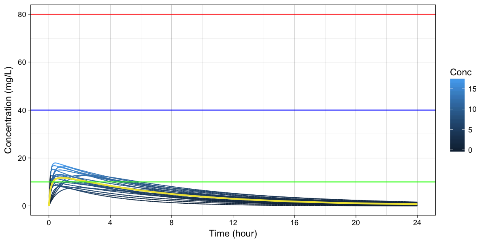
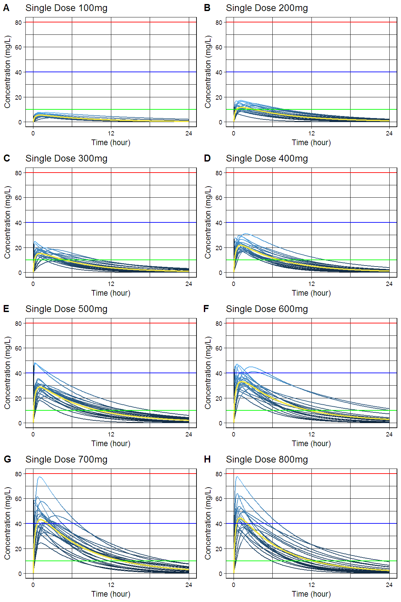
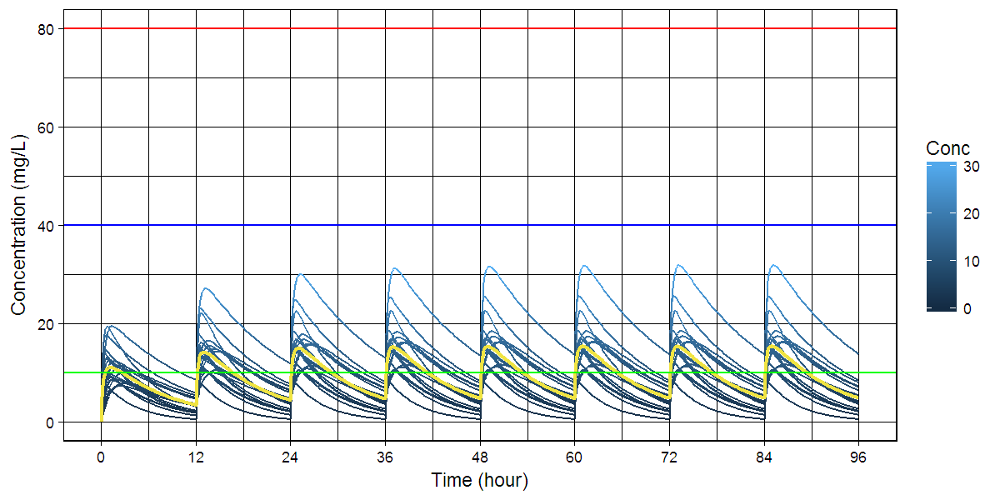
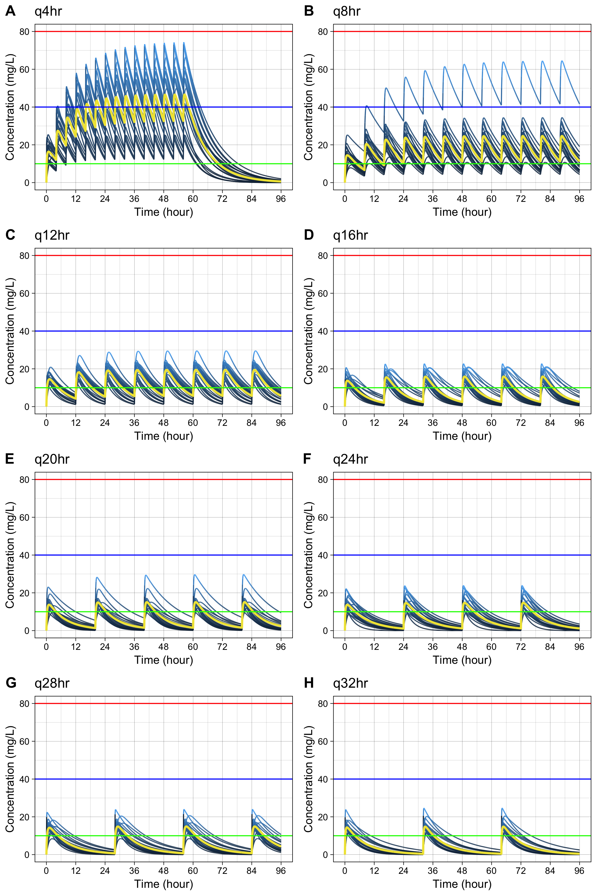

# R package: caffsim

[](https://doi.org/10.5281/zenodo.842649)

> Monte Carlo Simulation of Plasma Caffeine Concentrations by Using Population Pharmacokinetic Model

- This package is used for publication of the paper about pharmacokinetics of plasma caffeine.
- Gitbook <http://asancpt.github.io/CaffeineEdison> is created solely dependent on this R package.
- Reproducible research is expected.

## Installation


```r
install.pacakges("devtools")
devtools::install_github("asancpt/caffsim")

# Simply create single dose dataset
caffsim::caffDataset(Weight = 20, Dose = 200, N = 20) 

# Simply create multiple dose dataset
caffsim::caffDatasetMulti(Weight = 20, Dose = 200, N = 20, Tau = 12) 
```

## Single dose

### Create a PK dataset for caffeine single dose


```r
library(caffsim)
MyDataset <- caffDataset(Weight = 20, Dose = 200, N = 20)
knitr::kable(head(MyDataset), format = 'markdown')
```


|      Tmax|      Cmax|       AUC| Half_life|       CL|        V|        Ka|        Ke|
|---------:|---------:|---------:|---------:|--------:|--------:|---------:|---------:|
| 0.4295771| 11.200306|  72.38347|  4.170024| 2.763062| 16.62631|  9.611860| 0.1661861|
| 1.0557504| 10.892805|  71.70492|  3.754070| 2.789209| 15.10950|  2.739506| 0.1845997|
| 1.6254760| 10.373164| 100.35826|  5.453397| 1.992860| 15.68234|  1.735315| 0.1270767|
| 0.7127161| 12.792011|  97.34929|  4.753358| 2.054458| 14.09173|  5.146130| 0.1457917|
| 1.6074536|  9.161395|  72.20065|  4.185217| 2.770058| 16.72914|  1.561561| 0.1655828|
| 0.1336259| 13.664167|  72.15867|  3.565826| 2.771670| 14.26161| 40.073017| 0.1943449|

### Create a dataset for concentration-time curve


```r
MyConcTime <- caffConcTime(Weight = 20, Dose = 200, N = 20)
knitr::kable(head(MyConcTime), format = 'markdown') 
```


| Subject| Time|      Conc|
|-------:|----:|---------:|
|       1|  0.0|  0.000000|
|       1|  0.1|  4.116398|
|       1|  0.2|  6.800683|
|       1|  0.3|  8.533257|
|       1|  0.4|  9.633592|
|       1|  0.5| 10.314140|

### Create a concentration-time curve


```r
caffPlot(MyConcTime)
```

<!-- -->

### Create plots for publication (according to the amount of caffeine)

- `cowplot` package is required


```r
#install.packages("cowplot") # if you don't have it
library(cowplot)

MyPlotPub <- lapply(
  c(seq(100, 800, by = 100)), 
  function(x) caffPlotMulti(caffConcTime(20, x, 20)) + 
    theme(legend.position="none") + 
    labs(title = paste0("Single Dose ", x, "mg")))

plot_grid(MyPlotPub[[1]], MyPlotPub[[2]],
          MyPlotPub[[3]], MyPlotPub[[4]],
          MyPlotPub[[5]], MyPlotPub[[6]],
          MyPlotPub[[7]], MyPlotPub[[8]],
          labels=LETTERS[1:8], ncol = 2, nrow = 4)
```

<!-- -->

## Multiple dose

### Create a PK dataset for caffeine multiple doses


```r
MyDatasetMulti <- caffDatasetMulti(Weight = 20, Dose = 200, N = 20, Tau = 12)
knitr::kable(head(MyDatasetMulti), format = 'markdown') 
```


|     TmaxS|     CmaxS|      AUCS|       AI|    Aavss|     Cavss|   Cmaxss|   Cminss|
|---------:|---------:|---------:|--------:|--------:|---------:|--------:|--------:|
| 0.5211563| 12.499746| 119.26217| 1.358286| 149.7651|  9.938515| 17.98986| 4.745332|
| 4.7333160|  8.288593| 141.39296| 1.518211| 185.6758| 11.782747| 19.22866| 6.563317|
| 0.5108273| 11.474718|  91.40546| 1.248720| 123.6927|  7.617121| 15.34749| 3.056913|
| 0.5718313| 16.096663| 171.14903| 1.434283| 167.0544| 14.262419| 24.43969| 7.400029|
| 0.7990406|  7.860003|  81.20430| 1.394066| 157.9660|  6.767025| 11.91909| 3.369215|
| 3.2520341|  8.906790| 102.70557| 1.249883| 123.9796|  8.558797| 17.22097| 3.442901|

### Create a dataset for concentration-time curve


```r
MyConcTimeMulti <- caffConcTimeMulti(Weight = 20, Dose = 200, N = 20, Tau = 12, Repeat = 10)
knitr::kable(head(MyConcTimeMulti), format = 'markdown')
```


| Subject| Time|     Conc|
|-------:|----:|--------:|
|       1|  0.0| 0.000000|
|       1|  0.2| 4.712591|
|       1|  0.4| 7.232662|
|       1|  0.6| 8.535693|
|       1|  0.8| 9.164067|
|       1|  1.0| 9.419339|

### Create a concentration-time curve


```r
caffPlotMulti(MyConcTimeMulti)
```

<!-- -->

### Create plots for publication (according to dosing interval)

- `cowplot` package is required


```r
#install.packages("cowplot") # if you don't have it
library(cowplot)

MyPlotMultiPub <- lapply(
  c(seq(4, 32, by = 4)), 
  function(x) caffPlotMulti(caffConcTimeMulti(20, 250, 20, x, 15)) + 
    theme(legend.position="none") + 
    labs(title = paste0("q", x, "hr" )))

plot_grid(MyPlotMultiPub[[1]], MyPlotMultiPub[[2]],
          MyPlotMultiPub[[3]], MyPlotMultiPub[[4]],
          MyPlotMultiPub[[5]], MyPlotMultiPub[[6]],
          MyPlotMultiPub[[7]], MyPlotMultiPub[[8]],
          labels=LETTERS[1:8], ncol = 2, nrow = 4)
```

<!-- -->
