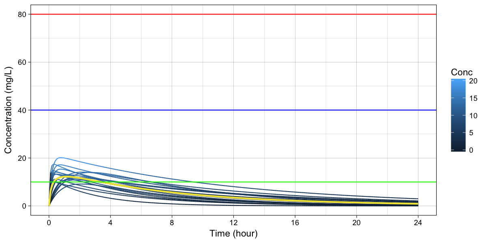
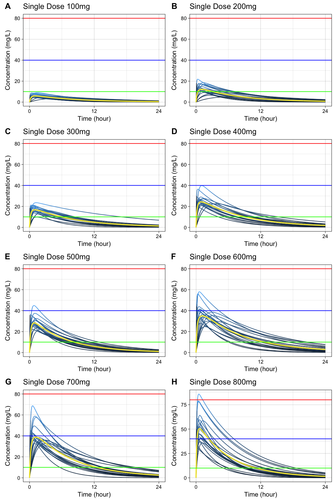
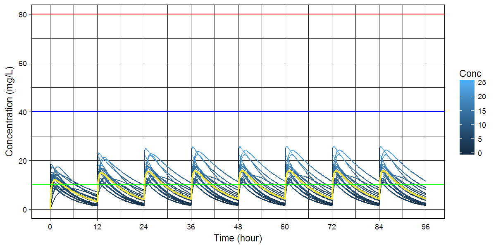
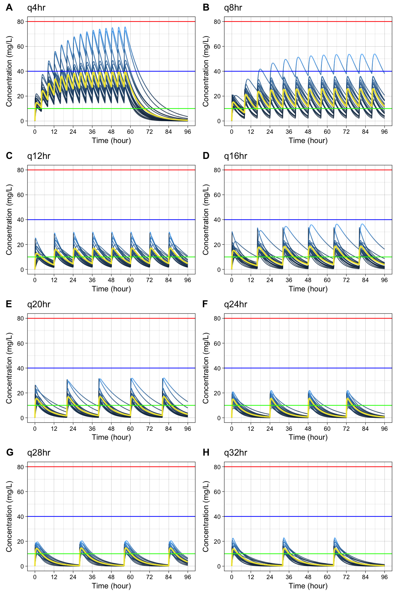

# R package: caffsim

> Monte Carlo Simulation of Plasma Caffeine Concentrations by Using Population Pharmacokinetic Model

- This package is used for publication of the paper about pharmacokinetics of plasma caffeine.
- Gitbook <http://asancpt.github.io/CaffeineEdison> is created solely dependent on this R package.
- Reproducible research is expected.


## Installation


```r
install.pacakges("devtools")
devtools::install_github("asancpt/caffsim")

# Simply create single dose dataset
caffsim::Dataset(Weight = 20, Dose = 200, N = 20) 

# Simply create multiple dose dataset
caffsim::DatasetMulti(Weight = 20, Dose = 200, N = 20, Tau = 12) 
```

## Single dose

### Create a PK dataset for caffeine single dose


```r
MyDataset <- caffsim::Dataset(Weight = 20, Dose = 200, N = 20)
knitr::kable(head(MyDataset), format = "markdown")
```


|      Tmax|     Cmax|       AUC| Half_life|       CL|        V|        Ka|        Ke|
|---------:|--------:|---------:|---------:|--------:|--------:|---------:|---------:|
| 0.3785298| 15.06647|  91.68202|  3.945785| 2.181453| 12.42070| 11.138527| 0.1756304|
| 0.4257118| 10.77650|  52.25902|  3.050845| 3.827091| 16.84828|  8.823484| 0.2271502|
| 0.2878909| 12.32183|  72.69608|  3.883826| 2.751180| 15.41862| 15.738742| 0.1784323|
| 0.2039763| 16.42340| 110.40026|  4.514844| 1.811590| 11.80238| 25.151580| 0.1534937|
| 1.1243202| 12.78550|  78.83161|  3.397083| 2.537053| 12.43662|  2.394488| 0.2039986|
| 0.8624561| 14.75649| 127.29989|  5.345934| 1.571093| 12.11971|  4.148034| 0.1296312|

### Create a dataset for concentration-time curve


```r
MyConcTime <- ConcTime(Weight = 20, Dose = 200, N = 20)
knitr::kable(head(MyConcTime), format = "markdown")
```


| Subject| Time|      Conc|
|-------:|----:|---------:|
|       1|  0.0|  0.000000|
|       1|  0.1|  9.166517|
|       1|  0.2| 13.487183|
|       1|  0.3| 15.440502|
|       1|  0.4| 16.238729|
|       1|  0.5| 16.474761|

### Create a concentration-time curve


```r
Plot(MyConcTime)
```

<!-- -->

### Create plots for publication (according to the amount of caffeine)

- `cowplot` package is required


```r
#install.packages("cowplot") # if you don't have it
library(cowplot)

MyPlotPub <- lapply(
    c(seq(100, 800, by = 100)), 
    function(x) PlotMulti(ConcTime(20, x, 20)) + 
        theme(legend.position="none") + 
        labs(title = paste0("Single Dose ", x, "mg")))

plot(plot_grid(MyPlotPub[[1]], MyPlotPub[[2]],
               MyPlotPub[[3]], MyPlotPub[[4]],
               MyPlotPub[[5]], MyPlotPub[[6]],
               MyPlotPub[[7]], MyPlotPub[[8]],
               labels=LETTERS[1:8], ncol = 2, nrow = 4))
```

<!-- -->

## Multiple dose

### Create a PK dataset for caffeine multiple doses


```r
MyDatasetMulti <- DatasetMulti(Weight = 20, Dose = 200, N = 20, Tau = 12)
knitr::kable(head(MyDatasetMulti), format = "markdown")
```


|     TmaxS|     CmaxS|      AUCS|       AI|     Aavss|     Cavss|   Cmaxss|   Cminss|
|---------:|---------:|---------:|--------:|---------:|---------:|--------:|--------:|
| 0.4773438|  9.828731|  65.89943| 1.169238| 103.26146|  5.491619| 12.41054| 1.796327|
| 0.5567628| 13.417170| 101.55730| 1.218972| 116.25212|  8.463108| 17.71121| 3.181579|
| 0.6357044| 16.389336| 130.04796| 1.237558| 120.92445| 10.837330| 22.13601| 4.249156|
| 2.5059227|  8.533056| 100.25261| 1.347330| 147.22872|  8.354384| 15.25884| 3.933596|
| 4.4354898| 13.055338| 194.85267| 1.374621| 153.52403| 16.237722| 29.01733| 7.908004|
| 0.8779352| 12.965603|  85.70703| 1.136421|  94.14813|  7.142252| 17.20634| 2.065525|

### Create a dataset for concentration-time curve


```r
MyConcTimeMulti <- ConcTimeMulti(Weight = 20, Dose = 200, N = 20, Tau = 12, Repeat = 10)
knitr::kable(head(MyConcTimeMulti), format = "markdown")
```


| Subject| Time|     Conc|
|-------:|----:|--------:|
|       1|  0.0|  0.00000|
|       1|  0.2| 18.72391|
|       1|  0.4| 18.29153|
|       1|  0.6| 17.73802|
|       1|  0.8| 17.20031|
|       1|  1.0| 16.67890|

### Create a concentration-time curve


```r
PlotMulti(MyConcTimeMulti)
```

<!-- -->

### Create plots for publication (according to dosing interval)

- `cowplot` package is required


```r
#install.packages("cowplot") # if you don't have it
library(cowplot)

MyPlotMultiPub <- lapply(
    c(seq(4, 32, by = 4)), 
    function(x) PlotMulti(ConcTimeMulti(20, 250, 20, x, 15)) + 
        theme(legend.position="none") + 
        labs(title = paste0("q", x, "hr" )))

plot(plot_grid(MyPlotMultiPub[[1]], MyPlotMultiPub[[2]],
               MyPlotMultiPub[[3]], MyPlotMultiPub[[4]],
               MyPlotMultiPub[[5]], MyPlotMultiPub[[6]],
               MyPlotMultiPub[[7]], MyPlotMultiPub[[8]],
               labels=LETTERS[1:8], ncol = 2, nrow = 4))
```

<!-- -->
