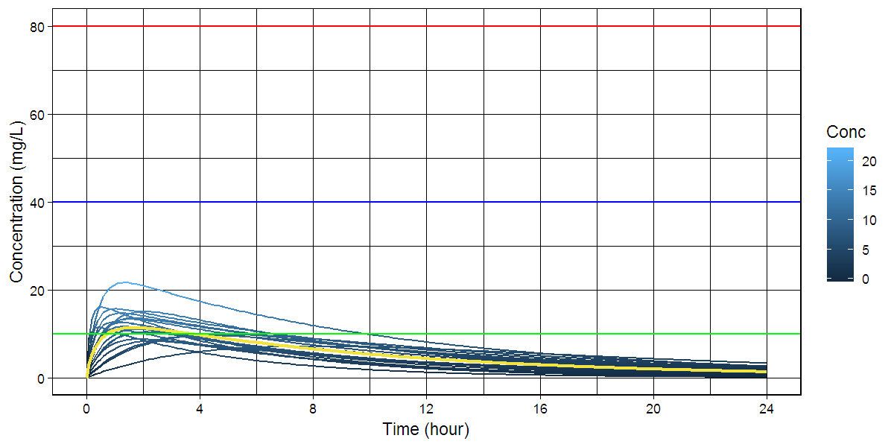

# R package: caffsim

> Monte Carlo Simulation of Plasma Caffeine Concentrations by Using Population Pharmacokinetic Model

- This package is used for publication of the paper about pharmacokinetics of plasma caffeine.
- Gitbook <http://asancpt.github.io/CaffeineEdison> is created solely dependent on this R package.
- Reproducible research is expected.

## Installation


```r
install.pacakges("devtools")
devtools::install_github("asancpt/caffsim")

# Simply create single dose dataset
caffsim::caffDataset(Weight = 20, Dose = 200, N = 20) 

# Simply create multiple dose dataset
caffsim::caffDatasetMulti(Weight = 20, Dose = 200, N = 20, Tau = 12) 
```

## Single dose

### Create a PK dataset for caffeine single dose


```r
library(caffsim)
MyDataset <- caffDataset(Weight = 20, Dose = 200, N = 20)
knitr::kable(head(MyDataset))
```

      Tmax        Cmax         AUC   Half_life         CL          V          Ka          Ke
----------  ----------  ----------  ----------  ---------  ---------  ----------  ----------
 0.7776109   10.567459    60.69779    3.396494   3.295013   16.14934    4.045327   0.2040339
 0.5247960    9.923271    55.00315    3.457693   3.636156   18.14244    6.960282   0.2004227
 0.6431633   10.418663   110.02141    6.857586   1.817828   17.98833    6.598512   0.1010560
 0.7039204   13.833981    75.87181    3.274701   2.636025   12.45627    4.579301   0.2116224
 0.3819273   11.308010    63.10853    3.592874   3.169144   16.43050   10.710281   0.1928818
 0.9321291   11.589101    65.22935    3.184408   3.066104   14.08907    3.049987   0.2176228

### Create a dataset for concentration-time curve


```r
MyConcTime <- caffConcTime(Weight = 20, Dose = 200, N = 20)
knitr::kable(head(MyConcTime))
```


 Subject   Time       Conc
--------  -----  ---------
       1    0.0   0.000000
       1    0.1   1.916637
       1    0.2   3.503230
       1    0.3   4.812908
       1    0.4   5.890289
       1    0.5   6.772843

### Create a concentration-time curve


```r
caffPlot(MyConcTime)
```

<!-- -->

### Create plots for publication (according to the amount of caffeine)

- `cowplot` package is required


```r
#install.packages("cowplot") # if you don't have it
library(cowplot)

MyPlotPub <- lapply(
  c(seq(100, 800, by = 100)), 
  function(x) caffPlotMulti(caffConcTime(20, x, 20)) + 
    theme(legend.position="none") + 
    labs(title = paste0("Single Dose ", x, "mg")))

plot_grid(MyPlotPub[[1]], MyPlotPub[[2]],
          MyPlotPub[[3]], MyPlotPub[[4]],
          MyPlotPub[[5]], MyPlotPub[[6]],
          MyPlotPub[[7]], MyPlotPub[[8]],
          labels=LETTERS[1:8], ncol = 2, nrow = 4)
```

<!-- -->

## Multiple dose

### Create a PK dataset for caffeine multiple doses


```r
MyDatasetMulti <- caffDatasetMulti(Weight = 20, Dose = 200, N = 20, Tau = 12)
knitr::kable(head(MyDatasetMulti))
```

     TmaxS       CmaxS        AUCS         AI       Aavss       Cavss     Cmaxss     Cminss
----------  ----------  ----------  ---------  ----------  ----------  ---------  ---------
 1.1182720    8.629289    63.93589   1.167687   102.84228    5.327991   12.07380   1.733873
 0.7399023   18.149541   107.68076   1.107077    85.44083    8.973397   23.20571   2.244463
 0.2484624   19.324724   105.66282   1.111206    86.70719    8.805235   22.52196   2.253929
 1.0115241   15.295759   183.16914   1.499428   181.54300   15.264095   25.16186   8.380886
 0.9198408   15.738922   137.56975   1.270960   129.13399   11.464146   22.51949   4.800999
 3.4830363   10.609518   139.92981   1.352849   148.50802   11.660818   21.20090   5.529603

### Create a dataset for concentration-time curve


```r
MyConcTimeMulti <- caffConcTimeMulti(Weight = 20, Dose = 200, N = 20, Tau = 12, Repeat = 10)
knitr::kable(head(MyConcTimeMulti))
```


 Subject   Time       Conc
--------  -----  ---------
       1    0.0   0.000000
       1    0.2   5.077558
       1    0.4   7.194572
       1    0.6   7.995335
       1    0.8   8.213161
       1    1.0   8.175024

### Create a concentration-time curve


```r
caffPlotMulti(MyConcTimeMulti)
```

<!-- -->

### Create plots for publication (according to dosing interval)

- `cowplot` package is required


```r
#install.packages("cowplot") # if you don't have it
library(cowplot)

MyPlotMultiPub <- lapply(
  c(seq(4, 32, by = 4)), 
  function(x) caffPlotMulti(caffConcTimeMulti(20, 250, 20, x, 15)) + 
    theme(legend.position="none") + 
    labs(title = paste0("q", x, "hr" )))

plot_grid(MyPlotMultiPub[[1]], MyPlotMultiPub[[2]],
          MyPlotMultiPub[[3]], MyPlotMultiPub[[4]],
          MyPlotMultiPub[[5]], MyPlotMultiPub[[6]],
          MyPlotMultiPub[[7]], MyPlotMultiPub[[8]],
          labels=LETTERS[1:8], ncol = 2, nrow = 4)
```

<!-- -->
