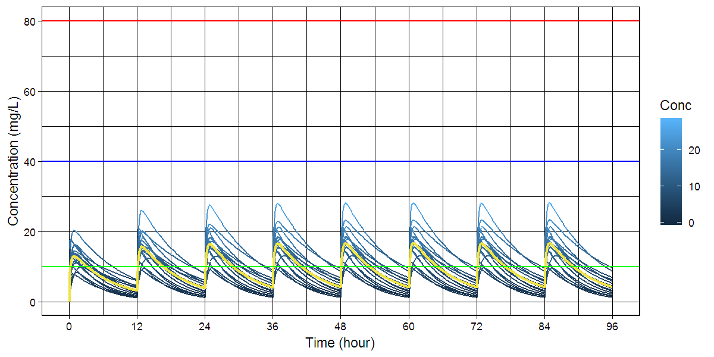

# `caffsim` R package: Simulation of Plasma Caffeine Concentrations by Using Population Pharmacokinetic Model

[](https://doi.org/10.5281/zenodo.842649)

[](https://cran.r-project.org/package=caffsim)

> Simulate plasma caffeine concentrations using population
> pharmacokinetic model described in Lee, Kim, Perera, McLachlan and Bae
> (2015) <doi:10.1007/s00431-015-2581-x> and the package was published
> <doi:10.12793/tcp.2017.25.3.141>.


  - Github: <https://github.com/asancpt/caffsim>
  - Package vignettes and references by `pkgdown`:
    <http://asancpt.github.io/caffsim>

## Installation

``` r
install.pacakges("devtools")
devtools::install_github("asancpt/caffsim")

# Simply create single dose dataset
caffsim::caffPkparam(Weight = 20, Dose = 200, N = 20) 

# Simply create multiple dose dataset
caffsim::caffPkparamMulti(Weight = 20, Dose = 200, N = 20, Tau = 12) 
```

## Single dose

### Create a PK dataset for caffeine single dose

``` r
library(caffsim)
MyDataset <- caffPkparam(Weight = 20, Dose = 200, N = 20)
head(MyDataset)
```

<div class="kable-table">

| subjid |      Tmax |      Cmax |       AUC | Half\_life |       CL |        V |         Ka |        Ke |
| -----: | --------: | --------: | --------: | ---------: | -------: | -------: | ---------: | --------: |
|      1 | 0.9858664 | 15.006075 | 115.44184 |   4.594639 | 1.732474 | 11.48643 |  3.2719387 | 0.1508280 |
|      2 | 3.8148250 |  7.699503 | 107.02942 |   6.354802 | 1.868645 | 17.13545 |  0.5169846 | 0.1090514 |
|      3 | 0.8826191 | 12.147005 | 107.60372 |   5.491894 | 1.858672 | 14.72962 |  4.0586205 | 0.1261860 |
|      4 | 0.2567103 | 13.950749 | 139.11091 |   6.730028 | 1.437702 | 13.96215 | 20.7765914 | 0.1029713 |
|      5 | 1.1563495 |  8.302007 |  65.44492 |   4.587332 | 3.056005 | 20.22931 |  2.6177408 | 0.1510682 |
|      6 | 1.2026953 |  9.445008 |  55.68603 |   3.130858 | 3.591565 | 16.22609 |  2.0869246 | 0.2213451 |

</div>

### Create a dataset for concentration-time curve

``` r
MyConcTime <- caffConcTime(Weight = 20, Dose = 200, N = 20)
head(MyConcTime)
```

<div class="kable-table">

| Subject | Time |      Conc |
| ------: | ---: | --------: |
|       1 |  0.0 |  0.000000 |
|       1 |  0.1 |  4.129452 |
|       1 |  0.2 |  7.174502 |
|       1 |  0.3 |  9.410497 |
|       1 |  0.4 | 11.042950 |
|       1 |  0.5 | 12.225252 |

</div>

### Create a concentration-time curve

``` r
caffPlot(MyConcTime)
```

<!-- -->

### Create plots for publication (according to the amount of caffeine)

  - `cowplot` package is required

<!-- end list -->

``` r
#install.packages("cowplot") # if you don't have it
library(cowplot)

MyPlotPub <- lapply(
  c(seq(100, 800, by = 100)), 
  function(x) caffPlotMulti(caffConcTime(20, x, 20)) + 
    theme(legend.position="none") + 
    labs(title = paste0("Single Dose ", x, "mg")))

plot_grid(MyPlotPub[[1]], MyPlotPub[[2]],
          MyPlotPub[[3]], MyPlotPub[[4]],
          MyPlotPub[[5]], MyPlotPub[[6]],
          MyPlotPub[[7]], MyPlotPub[[8]],
          labels=LETTERS[1:8], ncol = 2, nrow = 4)
```

<!-- -->

## Multiple dose

### Create a PK dataset for caffeine multiple doses

``` r
MyDatasetMulti <- caffPkparamMulti(Weight = 20, Dose = 200, N = 20, Tau = 12)
head(MyDatasetMulti)
```

<div class="kable-table">

| subjid |     TmaxS |    CmaxS |      AUCS |       AI |     Aavss |     Cavss |   Cmaxss |   Cminss |
| -----: | --------: | -------: | --------: | -------: | --------: | --------: | -------: | -------: |
|      1 | 0.9548818 | 14.35410 |  78.14388 | 1.068908 |  72.79768 |  6.511990 | 19.08368 | 1.230238 |
|      2 | 1.1467783 | 11.52173 |  89.29910 | 1.187191 | 108.04592 |  7.441592 | 16.31939 | 2.573172 |
|      3 | 0.6768031 | 16.69770 | 136.35979 | 1.250128 | 124.04012 | 11.363316 | 22.85721 | 4.573316 |
|      4 | 0.7753311 | 14.44837 | 119.92576 | 1.251847 | 124.46355 |  9.993813 | 20.06162 | 4.036002 |
|      5 | 0.2400863 | 13.36207 |  65.42138 | 1.081913 |  77.33312 |  5.451782 | 15.22267 | 1.152520 |
|      6 | 0.6535510 | 10.73536 |  76.56109 | 1.183885 | 107.17374 |  6.380091 | 14.06610 | 2.184791 |

</div>

### Create a dataset for concentration-time curve

``` r
MyConcTimeMulti <- caffConcTimeMulti(Weight = 20, Dose = 200, N = 20, Tau = 12, Repeat = 10)
head(MyConcTimeMulti)
```

<div class="kable-table">

| Subject | Time |      Conc |
| ------: | ---: | --------: |
|       1 |  0.0 |  0.000000 |
|       1 |  0.1 |  4.915431 |
|       1 |  0.2 |  8.455652 |
|       1 |  0.3 | 10.989413 |
|       1 |  0.4 | 12.786772 |
|       1 |  0.5 | 14.045507 |

</div>

### Create a concentration-time curve

``` r
caffPlotMulti(MyConcTimeMulti)
```

<!-- -->

### Create plots for publication (according to dosing interval)

  - `cowplot` package is required

<!-- end list -->

``` r
#install.packages("cowplot") # if you don't have it
library(cowplot)

MyPlotMultiPub <- lapply(
  c(seq(4, 32, by = 4)), 
  function(x) caffPlotMulti(caffConcTimeMulti(20, 250, 20, x, 15)) + 
    theme(legend.position="none") + 
    labs(title = paste0("q", x, "hr" )))

plot_grid(MyPlotMultiPub[[1]], MyPlotMultiPub[[2]],
          MyPlotMultiPub[[3]], MyPlotMultiPub[[4]],
          MyPlotMultiPub[[5]], MyPlotMultiPub[[6]],
          MyPlotMultiPub[[7]], MyPlotMultiPub[[8]],
          labels=LETTERS[1:8], ncol = 2, nrow = 4)
```

<!-- -->

## Interactive shiny app

``` r
caffShiny()
```
