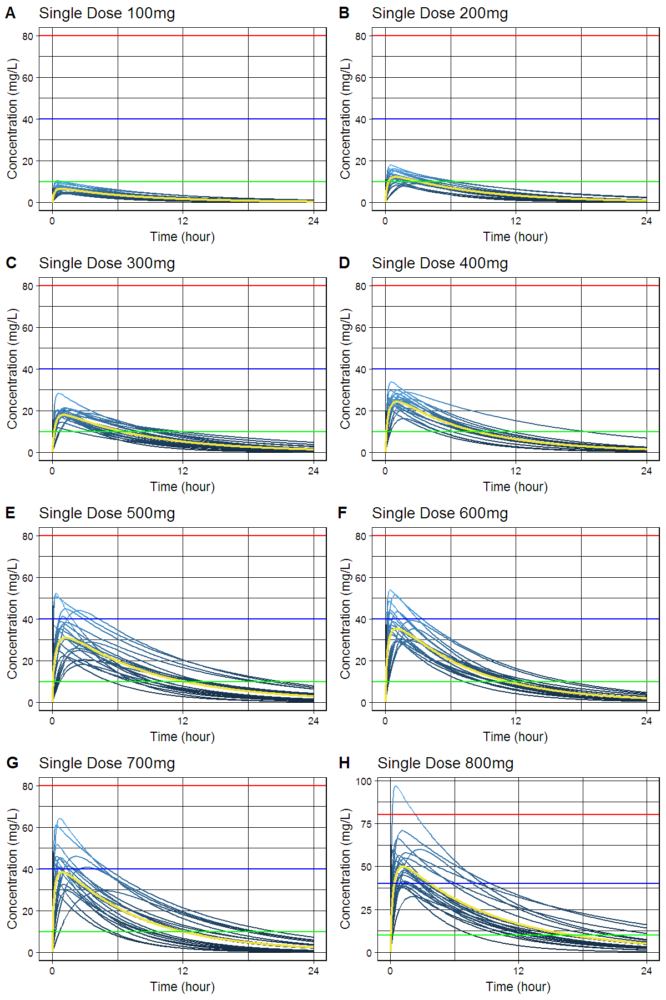

# `caffsim` R package: Simulation of Plasma Caffeine Concentrations by Using Population Pharmacokinetic Model

[](https://doi.org/10.5281/zenodo.842649) 

[](https://cran.r-project.org/package=caffsim)

> Simulate plasma caffeine concentrations using population pharmacokinetic model described in Lee, Kim, Perera, McLachlan and Bae (2015) <doi:10.1007/s00431-015-2581-x>.

- Github: <https://github.com/asancpt/caffsim>
- Package vignettes and references by `pkgdown`: <http://asancpt.github.io/caffsim> 

## Installation


```r
install.pacakges("devtools")
devtools::install_github("asancpt/caffsim")

# Simply create single dose dataset
caffsim::caffPkparam(Weight = 20, Dose = 200, N = 20) 

# Simply create multiple dose dataset
caffsim::caffPkparamMulti(Weight = 20, Dose = 200, N = 20, Tau = 12) 
```

## Single dose

### Create a PK dataset for caffeine single dose


```r
library(caffsim)
MyDataset <- caffPkparam(Weight = 20, Dose = 200, N = 20)
knitr::kable(head(MyDataset), format = 'markdown')
```


| subjid|      Tmax|     Cmax|       AUC| Half_life|       CL|        V|        Ka|        Ke|
|------:|---------:|--------:|---------:|---------:|--------:|--------:|---------:|---------:|
|      1| 1.9810483| 11.44336| 105.09014|  4.773514| 1.903128| 13.10910|  1.219467| 0.1451761|
|      2| 2.0373718| 11.28920|  90.41327|  3.844038| 2.212065| 12.27022|  1.040835| 0.1802792|
|      3| 0.8365284|  7.57785|  79.84833|  6.696642| 2.504749| 24.20405|  4.653073| 0.1034847|
|      4| 2.3112975| 16.98468| 198.93592|  6.292848| 1.005349|  9.12916|  1.109639| 0.1101250|
|      5| 0.5377783| 11.15775|  78.04757|  4.458783| 2.562540| 16.48746|  7.318150| 0.1554236|
|      6| 0.1134133| 13.98497|  87.58165|  4.260625| 2.283584| 14.03967| 50.811607| 0.1626522|

### Create a dataset for concentration-time curve


```r
MyConcTime <- caffConcTime(Weight = 20, Dose = 200, N = 20)
knitr::kable(head(MyConcTime), format = 'markdown') 
```


| Subject| Time|      Conc|
|-------:|----:|---------:|
|       1|  0.0|  0.000000|
|       1|  0.1|  5.942112|
|       1|  0.2|  9.296875|
|       1|  0.3| 11.164211|
|       1|  0.4| 12.176723|
|       1|  0.5| 12.698238|

### Create a concentration-time curve


```r
caffPlot(MyConcTime)
```

<!-- -->

### Create plots for publication (according to the amount of caffeine)

- `cowplot` package is required


```r
#install.packages("cowplot") # if you don't have it
library(cowplot)

MyPlotPub <- lapply(
  c(seq(100, 800, by = 100)), 
  function(x) caffPlotMulti(caffConcTime(20, x, 20)) + 
    theme(legend.position="none") + 
    labs(title = paste0("Single Dose ", x, "mg")))

plot_grid(MyPlotPub[[1]], MyPlotPub[[2]],
          MyPlotPub[[3]], MyPlotPub[[4]],
          MyPlotPub[[5]], MyPlotPub[[6]],
          MyPlotPub[[7]], MyPlotPub[[8]],
          labels=LETTERS[1:8], ncol = 2, nrow = 4)
```

<!-- -->

## Multiple dose

### Create a PK dataset for caffeine multiple doses


```r
MyDatasetMulti <- caffPkparamMulti(Weight = 20, Dose = 200, N = 20, Tau = 12)
knitr::kable(head(MyDatasetMulti), format = 'markdown') 
```


| subjid|     TmaxS|     CmaxS|      AUCS|       AI|    Aavss|     Cavss|   Cmaxss|   Cminss|
|------:|---------:|---------:|---------:|--------:|--------:|---------:|--------:|--------:|
|      1| 2.6506014|  8.865132|  83.95457| 1.166105| 102.4137|  6.996214| 15.89896| 2.264721|
|      2| 0.3686740| 11.021902|  72.62097| 1.169259| 103.2672|  6.051747| 13.67587| 1.979685|
|      3| 0.4443687|  9.474429|  74.16883| 1.244230| 122.5825|  6.180736| 12.52098| 2.457746|
|      4| 0.4554186| 16.064020| 114.80405| 1.198590| 111.0243|  9.567004| 20.61361| 3.415389|
|      5| 2.0388767| 15.655725| 166.84373| 1.311495| 138.8372| 13.903644| 26.21290| 6.225865|
|      6| 1.5384108|  8.071457|  63.42676| 1.163112| 101.5997|  5.285563| 12.07664| 1.693602|

### Create a dataset for concentration-time curve


```r
MyConcTimeMulti <- caffConcTimeMulti(Weight = 20, Dose = 200, N = 20, Tau = 12, Repeat = 10)
knitr::kable(head(MyConcTimeMulti), format = 'markdown')
```


| Subject| Time|     Conc|
|-------:|----:|--------:|
|       1|  0.0|  0.00000|
|       1|  0.1| 10.36586|
|       1|  0.2| 14.14247|
|       1|  0.3| 15.42906|
|       1|  0.4| 15.77591|
|       1|  0.5| 15.76929|

### Create a concentration-time curve


```r
caffPlotMulti(MyConcTimeMulti)
```

<!-- -->

### Create plots for publication (according to dosing interval)

- `cowplot` package is required


```r
#install.packages("cowplot") # if you don't have it
library(cowplot)

MyPlotMultiPub <- lapply(
  c(seq(4, 32, by = 4)), 
  function(x) caffPlotMulti(caffConcTimeMulti(20, 250, 20, x, 15)) + 
    theme(legend.position="none") + 
    labs(title = paste0("q", x, "hr" )))

plot_grid(MyPlotMultiPub[[1]], MyPlotMultiPub[[2]],
          MyPlotMultiPub[[3]], MyPlotMultiPub[[4]],
          MyPlotMultiPub[[5]], MyPlotMultiPub[[6]],
          MyPlotMultiPub[[7]], MyPlotMultiPub[[8]],
          labels=LETTERS[1:8], ncol = 2, nrow = 4)
```

<!-- -->

## Interactive shiny app

```r
caffShiny()
```

