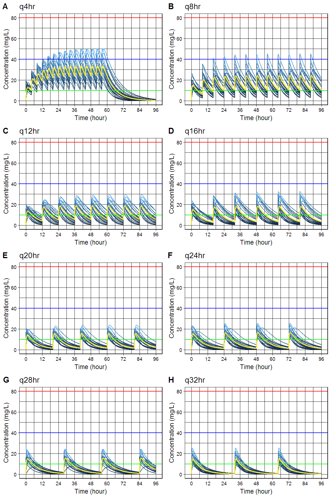

# `caffsim` R package: Simulation of Plasma Caffeine Concentrations by Using Population Pharmacokinetic Model

[](https://doi.org/10.5281/zenodo.842649)

[](https://cran.r-project.org/package=caffsim)

> Simulate plasma caffeine concentrations using population
> pharmacokinetic model described in Lee, Kim, Perera, McLachlan and Bae
> (2015) <doi:10.1007/s00431-015-2581-x> and the package was published
> <doi:10.12793/tcp.2017.25.3.141>.

  - Github: <https://github.com/asancpt/caffsim>
  - Package vignettes and references by `pkgdown`:
    <http://asancpt.github.io/caffsim>

## Installation

``` r
install.pacakges("devtools")
devtools::install_github("asancpt/caffsim")

# Simply create single dose dataset
caffsim::caffPkparam(Weight = 20, Dose = 200, N = 20) 

# Simply create multiple dose dataset
caffsim::caffPkparamMulti(Weight = 20, Dose = 200, N = 20, Tau = 12) 
```

## Single dose

### Create a PK dataset for caffeine single dose

``` r
library(caffsim)
MyDataset <- caffPkparam(Weight = 20, Dose = 200, N = 20)
head(MyDataset)
```

<div class="kable-table">

| subjid |      Tmax |      Cmax |       AUC | Half\_life |       CL |        V |        Ka |        Ke |
| -----: | --------: | --------: | --------: | ---------: | -------: | -------: | --------: | --------: |
|      1 | 0.5194596 |  9.710550 |  97.80219 |   6.609751 | 2.044944 | 19.50443 |  8.585470 | 0.1048451 |
|      2 | 0.4870795 | 10.748842 |  91.26817 |   5.536198 | 2.191345 | 17.50609 |  8.873428 | 0.1251762 |
|      3 | 0.4368455 |  8.540756 |  55.79357 |   4.213235 | 3.584642 | 21.79356 |  9.433785 | 0.1644817 |
|      4 | 0.2012653 | 14.228951 | 101.69723 |   4.811495 | 1.966622 | 13.65424 | 25.950362 | 0.1440301 |
|      5 | 0.3205941 | 11.129203 |  93.31792 |   5.584126 | 2.143211 | 17.26979 | 15.100645 | 0.1241018 |
|      6 | 1.2226137 | 12.247683 |  78.30448 |   3.471000 | 2.554132 | 12.79277 |  2.139577 | 0.1996543 |

</div>

### Create a dataset for concentration-time curve

``` r
MyConcTime <- caffConcTime(Weight = 20, Dose = 200, N = 20)
head(MyConcTime)
```

<div class="kable-table">

| Subject | Time |     Conc |
| ------: | ---: | -------: |
|       1 |  0.0 |  0.00000 |
|       1 |  0.1 | 10.49597 |
|       1 |  0.2 | 14.03678 |
|       1 |  0.3 | 15.14666 |
|       1 |  0.4 | 15.40790 |
|       1 |  0.5 | 15.37391 |

</div>

### Create a concentration-time curve

``` r
caffPlot(MyConcTime)
```

<!-- -->

### Create plots for publication (according to the amount of caffeine)

  - `cowplot` package is required

<!-- end list -->

``` r
#install.packages("cowplot") # if you don't have it
library(cowplot)

MyPlotPub <- lapply(
  c(seq(100, 800, by = 100)), 
  function(x) caffPlotMulti(caffConcTime(20, x, 20)) + 
    theme(legend.position="none") + 
    labs(title = paste0("Single Dose ", x, "mg")))

plot_grid(MyPlotPub[[1]], MyPlotPub[[2]],
          MyPlotPub[[3]], MyPlotPub[[4]],
          MyPlotPub[[5]], MyPlotPub[[6]],
          MyPlotPub[[7]], MyPlotPub[[8]],
          labels=LETTERS[1:8], ncol = 2, nrow = 4)
```

<!-- -->

## Multiple dose

### Create a PK dataset for caffeine multiple doses

``` r
MyDatasetMulti <- caffPkparamMulti(Weight = 20, Dose = 200, N = 20, Tau = 12)
head(MyDatasetMulti)
```

<div class="kable-table">

| subjid |     TmaxS |     CmaxS |      AUCS |       AI |     Aavss |     Cavss |   Cmaxss |   Cminss |
| -----: | --------: | --------: | --------: | -------: | --------: | --------: | -------: | -------: |
|      1 | 0.2541962 | 13.100236 | 102.85866 | 1.259286 | 126.28953 |  8.571555 | 17.05856 | 3.512344 |
|      2 | 1.8335190 | 14.234663 | 122.88886 | 1.188412 | 108.36693 | 10.240738 | 22.41440 | 3.553600 |
|      3 | 2.7633525 |  8.409590 | 125.63729 | 1.568712 | 196.70501 | 10.469774 | 16.66444 | 6.041433 |
|      4 | 0.9212741 |  7.392237 |  66.14558 | 1.285233 | 132.57961 |  5.512132 | 10.66474 | 2.366834 |
|      5 | 0.7089271 | 14.195035 |  91.27202 | 1.137239 |  94.38233 |  7.606002 | 18.29125 | 2.207343 |
|      6 | 2.7223495 | 10.932040 | 136.36315 | 1.380501 | 154.87087 | 11.363596 | 20.21662 | 5.572216 |

</div>

### Create a dataset for concentration-time curve

``` r
MyConcTimeMulti <- caffConcTimeMulti(Weight = 20, Dose = 200, N = 20, Tau = 12, Repeat = 10)
head(MyConcTimeMulti)
```

<div class="kable-table">

| Subject | Time |      Conc |
| ------: | ---: | --------: |
|       1 |  0.0 | 0.0000000 |
|       1 |  0.1 | 0.6703409 |
|       1 |  0.2 | 1.2834175 |
|       1 |  0.3 | 1.8436798 |
|       1 |  0.4 | 2.3552351 |
|       1 |  0.5 | 2.8218749 |

</div>

### Create a concentration-time curve

``` r
caffPlotMulti(MyConcTimeMulti)
```

<!-- -->

### Create plots for publication (according to dosing interval)

  - `cowplot` package is required

<!-- end list -->

``` r
#install.packages("cowplot") # if you don't have it
library(cowplot)

MyPlotMultiPub <- lapply(
  c(seq(4, 32, by = 4)), 
  function(x) caffPlotMulti(caffConcTimeMulti(20, 250, 20, x, 15)) + 
    theme(legend.position="none") + 
    labs(title = paste0("q", x, "hr" )))

plot_grid(MyPlotMultiPub[[1]], MyPlotMultiPub[[2]],
          MyPlotMultiPub[[3]], MyPlotMultiPub[[4]],
          MyPlotMultiPub[[5]], MyPlotMultiPub[[6]],
          MyPlotMultiPub[[7]], MyPlotMultiPub[[8]],
          labels=LETTERS[1:8], ncol = 2, nrow = 4)
```

<!-- -->

## Interactive shiny app

``` r
caffShiny()
```
